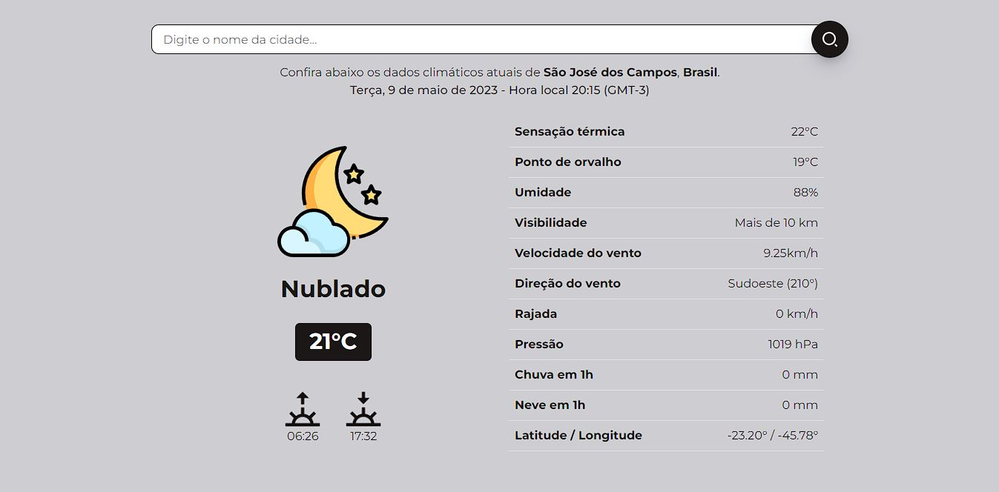

# Weather Tracker :partly_sunny:

## Descrição :page_with_curl:
Este projeto é uma página web que tem como objetivo fornecer informações meteorológicas atualizadas de diversas cidades do mundo. :earth_americas:   
Veja abaixo algumas de suas características:
- Apresenta diversas informaçoes climaticas de uma cidade escolhida pelo usuário como por exemplo temperatura, sensação térmica, umidade, velocidade do vento, etc.

- Utiliza a API **[OpenWeatherMap](https://openweathermap.org/api)**  para obter os dados meteorológicos em tempo real.

- Foi desenvolvido utilizando tecnologias web modernas como HTML5, CSS3 e JavaScript. O layout foi projetado com o framework Bootstrap para garantir uma visualização responsiva em diferentes tamanhos de tela.

- A página foi criada como parte de um projeto pessoal para fornecer informações meteorológicas precisas e atualizadas de uma maneira acessível e intuitiva. Todas as informações apresentadas foram obtidas da API OpenWeatherMap, que é uma fonte confiável e reconhecida de dados meteorológicos.

***
## Como acessar o site? :computer:

Para acessar o site **[clique aqui](https://gui-bus.github.io/weatherTracker/)**.

Espero que você goste do projeto e encontre todas as informações meteorológicas que precisa sobre a cidade desejada!

***

## Tecnologias utilizadas :dart:

 
  
  
  
  

***

## Contribuição :bulb:
Gostaria de contribuir para o projeto? Fico muito grato pelo interesse!
- Sinta-se à vontade para entrar em contato comigo através das minhas redes sociais para enviar suas mensagens, sugestões ou comentários sobre o projeto.

***

## Fontes e agracimentos :handshake:
Gostaria de expressar minha gratidão às seguintes fontes por sua contribuição para a criação deste projeto:

A OpenWeatherMap por fornecer a API gratuita que possibilitou a obtenção dos dados meteorológicos em tempo real.

- A **[OpenWeatherMap](https://openweathermap.org/)** por fornecer a API gratuita que possibilitou a obtenção dos dados meteorológicos em tempo real.

- A **[OneBitCode](https://onebitcode.com/lp/)** por fornecer o conhecimento e as habilidades necessárias para a criação do site por meio do curso FullStack.   
Muito obrigado! :rocket:

***

## Redes sociais para contato! :speech_balloon:

**Espero que tenha gostado do projeto e que ele possa ser útil para você obter informações meteorológicas precisas e atualizadas!**
